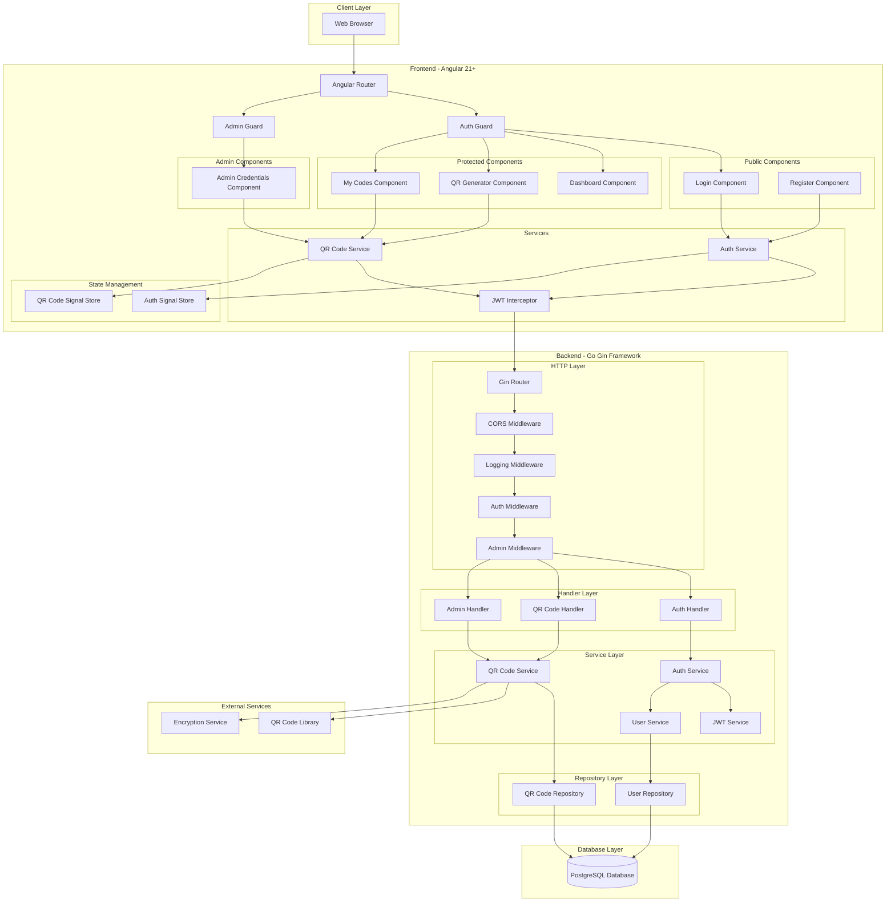
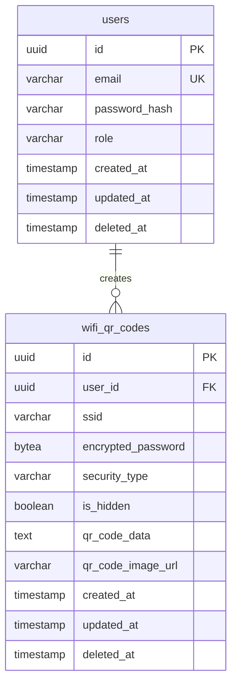
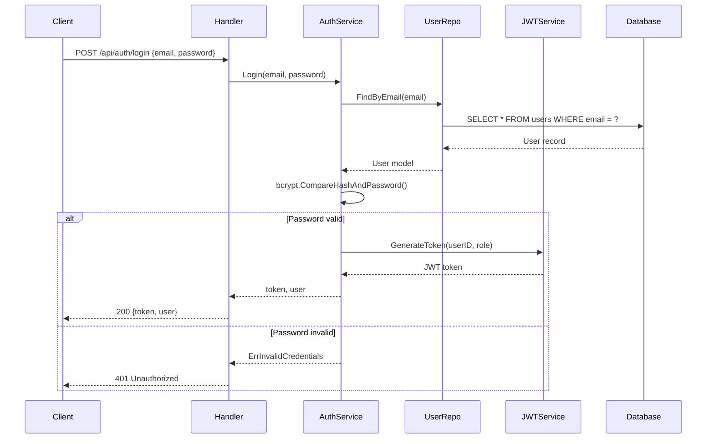
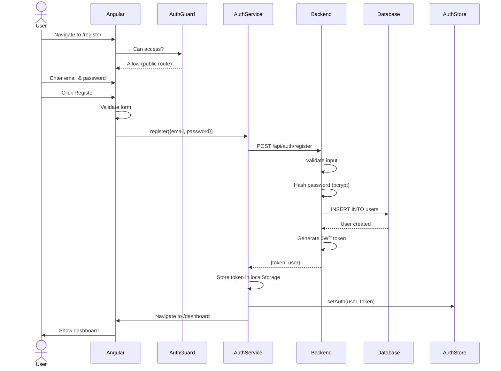
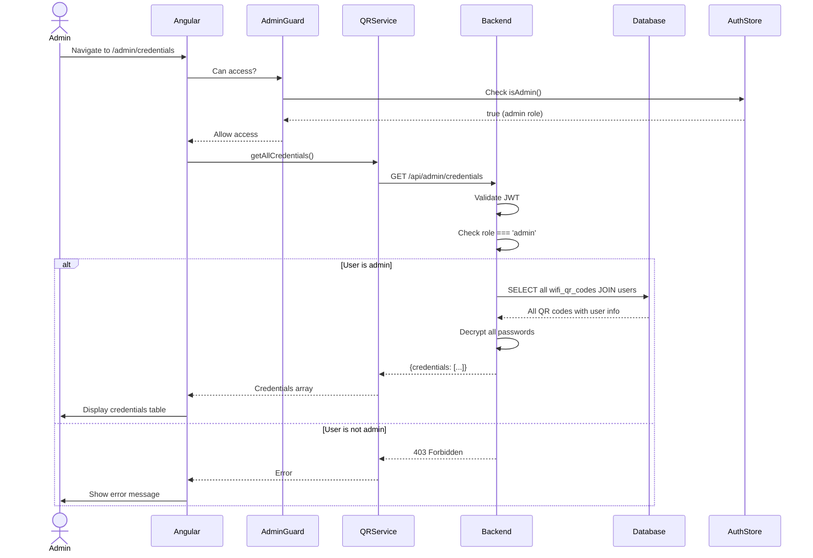

# WiFi QR Code Generator - System Architecture

## Table of Contents
1. [System Overview](#system-overview)
2. [Architecture Diagram](#architecture-diagram)
3. [Technology Stack](#technology-stack)
4. [Database Design](#database-design)
5. [Backend Architecture](#backend-architecture)
6. [Frontend Architecture](#frontend-architecture)
7. [API Specifications](#api-specifications)
8. [Security Architecture](#security-architecture)
9. [Deployment Architecture](#deployment-architecture)
10. [Data Flow](#data-flow)

---

## System Overview

The WiFi QR Code Generator is a full-stack web application that enables users to create scannable QR codes containing WiFi credentials. The system implements role-based access control with two distinct user roles (`user` and `admin`), allowing regular users to manage their own QR codes while administrators can view all credentials across the system.

### Key Features
- User authentication and authorization with JWT
- WiFi QR code generation and storage
- Role-based access control (RBAC)
- User-specific QR code management
- Admin dashboard for system-wide credential viewing
- Secure credential storage with encryption

### Business Requirements
- **Users** can register, login, create WiFi QR codes, and view their own codes
- **Admins** have all user permissions plus the ability to view all WiFi credentials system-wide
- All WiFi credentials must be stored securely
- QR codes must follow the standard WiFi format specification
- The system must be scalable and maintainable

---

## Architecture Diagram



---

## Technology Stack

### Frontend
- **Framework**: Angular 21+
  - Standalone components architecture
  - Signals for reactive state management
  - New control flow syntax (@if, @for, @switch)
  - Lazy loading for feature modules
- **Styling**: Tailwind CSS
- **HTTP Client**: Angular HttpClient with interceptors
- **Forms**: Reactive Forms with typed FormControls
- **QR Code**: ngx-qrcode or qrcode library
- **State Management**: Angular Signals with custom signal stores
- **Build Tool**: esbuild (Angular 17+ default)

### Backend
- **Language**: Go 1.21+
- **Framework**: Gin Web Framework
- **ORM**: GORM with PostgreSQL driver
- **Authentication**: JWT (golang-jwt/jwt)
- **Validation**: go-playground/validator
- **Environment Config**: godotenv
- **Password Hashing**: bcrypt
- **Logging**: zap (structured logging)
- **Encryption**: AES-256-GCM for credential storage

### Database
- **RDBMS**: PostgreSQL 16+
- **Containerization**: Docker with docker-compose
- **Migrations**: GORM AutoMigrate (development) / golang-migrate (production)
- **Connection Pooling**: pgx with configurable pool settings

### DevOps
- **Containerization**: Docker & Docker Compose
- **Version Control**: Git
- **API Documentation**: Swagger/OpenAPI (via swaggo/swag)

---

## Database Design

### Entity Relationship Diagram



### Schema Specifications

#### Table: `users`

| Column | Type | Constraints | Description |
|--------|------|-------------|-------------|
| id | UUID | PRIMARY KEY, DEFAULT gen_random_uuid() | Unique user identifier |
| email | VARCHAR(255) | UNIQUE, NOT NULL | User's email address (login identifier) |
| password_hash | VARCHAR(255) | NOT NULL | Bcrypt hashed password |
| role | VARCHAR(20) | NOT NULL, DEFAULT 'user', CHECK (role IN ('user', 'admin')) | User role for RBAC |
| created_at | TIMESTAMP | DEFAULT NOW() | Record creation timestamp |
| updated_at | TIMESTAMP | DEFAULT NOW() | Last update timestamp |
| deleted_at | TIMESTAMP | NULL | Soft delete timestamp (GORM convention) |

**Indexes**:
- Primary Key Index: `id`
- Unique Index: `email` (for fast login lookups)
- Index: `role` (for admin queries)
- Partial Index: `deleted_at IS NULL` (for active users queries)

**Sample Data**:
```sql
-- Admin user (password: Admin@123)
INSERT INTO users (id, email, password_hash, role) VALUES
('550e8400-e29b-41d4-a716-446655440000', 'admin@wifiqr.com', '$2a$10$...', 'admin');

-- Regular user (password: User@123)
INSERT INTO users (id, email, password_hash, role) VALUES
('550e8400-e29b-41d4-a716-446655440001', 'user@example.com', '$2a$10$...', 'user');
```

---

#### Table: `wifi_qr_codes`

| Column | Type | Constraints | Description |
|--------|------|-------------|-------------|
| id | UUID | PRIMARY KEY, DEFAULT gen_random_uuid() | Unique QR code identifier |
| user_id | UUID | FOREIGN KEY REFERENCES users(id), NOT NULL | Owner of the QR code |
| ssid | VARCHAR(32) | NOT NULL | WiFi network name (max 32 chars per IEEE 802.11) |
| encrypted_password | BYTEA | NULL | AES-256-GCM encrypted password (NULL for open networks) |
| security_type | VARCHAR(10) | NOT NULL, CHECK (security_type IN ('WPA', 'WPA2', 'WEP', 'nopass')) | WiFi security protocol |
| is_hidden | BOOLEAN | NOT NULL, DEFAULT FALSE | Whether the network is hidden |
| qr_code_data | TEXT | NOT NULL | Generated WiFi QR code string (WIFI:T:...;;) |
| qr_code_image_url | VARCHAR(500) | NULL | Optional: URL to stored QR code image |
| created_at | TIMESTAMP | DEFAULT NOW() | Record creation timestamp |
| updated_at | TIMESTAMP | DEFAULT NOW() | Last update timestamp |
| deleted_at | TIMESTAMP | NULL | Soft delete timestamp |

**Indexes**:
- Primary Key Index: `id`
- Foreign Key Index: `user_id` (for user's QR codes queries)
- Composite Index: `(user_id, created_at DESC)` (for paginated user queries)
- Partial Index: `deleted_at IS NULL` (for active QR codes)

**Foreign Key Constraints**:
```sql
ALTER TABLE wifi_qr_codes
ADD CONSTRAINT fk_user_id
FOREIGN KEY (user_id) REFERENCES users(id)
ON DELETE CASCADE;
```

**WiFi QR Code Format**:
```
WIFI:T:<security_type>;S:<ssid>;P:<password>;H:<true|false>;;
```

**Example**:
```
WIFI:T:WPA2;S:MyHomeWiFi;P:SecurePass123;H:false;;
```

---

### Migration Strategy

**Development**: Use GORM AutoMigrate for rapid iteration
```go
db.AutoMigrate(&models.User{}, &models.WiFiQRCode{})
```

**Production**: Use golang-migrate for versioned migrations

Migration file structure:
```
migrations/
├── 000001_create_users_table.up.sql
├── 000001_create_users_table.down.sql
├── 000002_create_wifi_qr_codes_table.up.sql
├── 000002_create_wifi_qr_codes_table.down.sql
├── 000003_add_indexes.up.sql
└── 000003_add_indexes.down.sql
```

---

## Backend Architecture

### Project Structure

```
backend/
├── cmd/
│   └── server/
│       └── main.go                 # Application entry point
├── internal/
│   ├── config/
│   │   └── config.go              # Environment configuration
│   ├── database/
│   │   ├── postgres.go            # PostgreSQL connection
│   │   └── migrations.go          # Migration runner
│   ├── middleware/
│   │   ├── auth.go                # JWT authentication middleware
│   │   ├── admin.go               # Admin role check middleware
│   │   ├── cors.go                # CORS configuration
│   │   └── logger.go              # Request logging middleware
│   ├── models/
│   │   ├── user.go                # User model
│   │   └── wifi_qr_code.go        # WiFi QR code model
│   ├── handlers/
│   │   ├── auth_handler.go        # Authentication endpoints
│   │   ├── qr_handler.go          # QR code CRUD endpoints
│   │   └── admin_handler.go       # Admin-only endpoints
│   ├── services/
│   │   ├── auth_service.go        # Authentication logic
│   │   ├── jwt_service.go         # JWT generation/validation
│   │   ├── user_service.go        # User business logic
│   │   ├── qr_service.go          # QR code business logic
│   │   └── encryption_service.go  # Password encryption/decryption
│   ├── repositories/
│   │   ├── user_repository.go     # User data access
│   │   └── qr_repository.go       # QR code data access
│   └── utils/
│       ├── errors.go              # Custom error types
│       ├── validators.go          # Custom validators
│       └── response.go            # Standard API responses
├── pkg/
│   └── logger/
│       └── logger.go              # Zap logger setup
├── .env.example
├── go.mod
├── go.sum
└── Dockerfile
```

### Layer Responsibilities

#### 1. Handler Layer
**Responsibility**: HTTP request/response handling, input validation, routing

```go
// handlers/qr_handler.go
type QRHandler struct {
    qrService services.QRService
    logger    *zap.Logger
}

func (h *QRHandler) CreateQRCode(c *gin.Context) {
    // 1. Parse and validate request
    // 2. Extract user ID from JWT context
    // 3. Call service layer
    // 4. Return standardized response
}
```

**Key Principles**:
- Thin handlers - delegate business logic to services
- Use Gin's binding for request validation
- Extract JWT claims from context
- Return consistent JSON responses

---

#### 2. Service Layer
**Responsibility**: Business logic, orchestration, transactions

```go
// services/qr_service.go
type QRService interface {
    CreateQRCode(ctx context.Context, userID uuid.UUID, req CreateQRRequest) (*WiFiQRCode, error)
    GetUserQRCodes(ctx context.Context, userID uuid.UUID, page, pageSize int) ([]WiFiQRCode, int64, error)
    GetQRCodeByID(ctx context.Context, userID uuid.UUID, qrID uuid.UUID) (*WiFiQRCode, error)
    DeleteQRCode(ctx context.Context, userID uuid.UUID, qrID uuid.UUID) error
}
```

**Key Principles**:
- Interface-based design for testability
- Context propagation for cancellation
- Coordinate multiple repositories
- Handle encryption/decryption
- Generate WiFi QR code strings

---

#### 3. Repository Layer
**Responsibility**: Database operations, query construction

```go
// repositories/qr_repository.go
type QRRepository interface {
    Create(ctx context.Context, qrCode *models.WiFiQRCode) error
    FindByUserID(ctx context.Context, userID uuid.UUID, page, pageSize int) ([]models.WiFiQRCode, int64, error)
    FindByID(ctx context.Context, id uuid.UUID) (*models.WiFiQRCode, error)
    Update(ctx context.Context, qrCode *models.WiFiQRCode) error
    Delete(ctx context.Context, id uuid.UUID) error
    FindAll(ctx context.Context, page, pageSize int) ([]models.WiFiQRCode, int64, error)
}
```

**Key Principles**:
- GORM for ORM operations
- Preload associations when needed
- Use pagination for list queries
- Soft deletes via GORM conventions

---

### Middleware Stack

Middleware execution order (top to bottom):
1. **Recovery Middleware** (built-in Gin) - Panic recovery
2. **CORS Middleware** - Cross-origin request handling
3. **Logging Middleware** - Request/response logging
4. **Auth Middleware** - JWT validation (protected routes only)
5. **Admin Middleware** - Role verification (admin routes only)

```go
// cmd/server/main.go
router := gin.Default()

// Global middleware
router.Use(middleware.CORS())
router.Use(middleware.Logger(logger))

// Public routes
authGroup := router.Group("/api/auth")
{
    authGroup.POST("/register", authHandler.Register)
    authGroup.POST("/login", authHandler.Login)
}

// Protected routes (requires valid JWT)
apiGroup := router.Group("/api")
apiGroup.Use(middleware.AuthMiddleware(jwtService))
{
    apiGroup.POST("/qr-codes", qrHandler.CreateQRCode)
    apiGroup.GET("/qr-codes", qrHandler.GetMyQRCodes)
    apiGroup.GET("/qr-codes/:id", qrHandler.GetQRCode)
    apiGroup.DELETE("/qr-codes/:id", qrHandler.DeleteQRCode)
}

// Admin-only routes
adminGroup := router.Group("/api/admin")
adminGroup.Use(middleware.AuthMiddleware(jwtService))
adminGroup.Use(middleware.AdminMiddleware())
{
    adminGroup.GET("/credentials", adminHandler.GetAllCredentials)
}
```

---

### Authentication Flow



---

### QR Code Generation Flow

```mermaid
sequenceDiagram
    participant Client
    participant Handler
    participant AuthMW as Auth Middleware
    participant QRService
    participant EncService as Encryption Service
    participant QRRepo
    participant Database

    Client->>Handler: POST /api/qr-codes {ssid, password, security_type}
    Handler->>AuthMW: Validate JWT
    AuthMW-->>Handler: userID from claims
    Handler->>QRService: CreateQRCode(userID, request)
    QRService->>EncService: Encrypt(password)
    EncService-->>QRService: encryptedPassword
    QRService->>QRService: GenerateWiFiString()
    Note over QRService: WIFI:T:WPA2;S:ssid;P:password;H:false;;
    QRService->>QRRepo: Create(qrCodeModel)
    QRRepo->>Database: INSERT INTO wifi_qr_codes
    Database-->>QRRepo: Created record
    QRRepo-->>QRService: WiFiQRCode
    QRService->>EncService: Decrypt(encryptedPassword)
    EncService-->>QRService: plainPassword
    QRService-->>Handler: WiFiQRCode (with decrypted password)
    Handler-->>Client: 201 {qrCode}
```

---

### Security Service - Password Encryption

```go
// services/encryption_service.go
type EncryptionService struct {
    key []byte // 32 bytes for AES-256
}

func (s *EncryptionService) Encrypt(plaintext string) ([]byte, error) {
    // AES-256-GCM encryption
    block, err := aes.NewCipher(s.key)
    if err != nil {
        return nil, err
    }

    gcm, err := cipher.NewGCM(block)
    if err != nil {
        return nil, err
    }

    nonce := make([]byte, gcm.NonceSize())
    if _, err := io.ReadFull(rand.Reader, nonce); err != nil {
        return nil, err
    }

    ciphertext := gcm.Seal(nonce, nonce, []byte(plaintext), nil)
    return ciphertext, nil
}

func (s *EncryptionService) Decrypt(ciphertext []byte) (string, error) {
    // AES-256-GCM decryption
    block, err := aes.NewCipher(s.key)
    if err != nil {
        return "", err
    }

    gcm, err := cipher.NewGCM(block)
    if err != nil {
        return "", err
    }

    nonceSize := gcm.NonceSize()
    if len(ciphertext) < nonceSize {
        return "", errors.New("ciphertext too short")
    }

    nonce, ciphertext := ciphertext[:nonceSize], ciphertext[nonceSize:]
    plaintext, err := gcm.Open(nil, nonce, ciphertext, nil)
    if err != nil {
        return "", err
    }

    return string(plaintext), nil
}
```

**Why AES-256-GCM?**
- **Confidentiality**: Encrypts WiFi passwords
- **Integrity**: Authenticated encryption prevents tampering
- **Performance**: Hardware-accelerated on modern CPUs
- **Standard**: NIST-approved algorithm

---

## Frontend Architecture

### Project Structure

```
frontend/
├── src/
│   ├── app/
│   │   ├── core/
│   │   │   ├── guards/
│   │   │   │   ├── auth.guard.ts           # Authentication guard
│   │   │   │   └── admin.guard.ts          # Admin role guard
│   │   │   ├── interceptors/
│   │   │   │   ├── jwt.interceptor.ts      # Add JWT to requests
│   │   │   │   └── error.interceptor.ts    # Global error handling
│   │   │   ├── services/
│   │   │   │   ├── auth.service.ts         # Authentication service
│   │   │   │   ├── qr-code.service.ts      # QR code API service
│   │   │   │   └── storage.service.ts      # LocalStorage wrapper
│   │   │   ├── models/
│   │   │   │   ├── user.model.ts           # User interface
│   │   │   │   ├── qr-code.model.ts        # QR code interface
│   │   │   │   └── api-response.model.ts   # API response types
│   │   │   └── stores/
│   │   │       ├── auth.store.ts           # Auth signal store
│   │   │       └── qr-code.store.ts        # QR code signal store
│   │   ├── features/
│   │   │   ├── auth/
│   │   │   │   ├── login/
│   │   │   │   │   ├── login.component.ts
│   │   │   │   │   ├── login.component.html
│   │   │   │   │   └── login.component.css
│   │   │   │   └── register/
│   │   │   │       ├── register.component.ts
│   │   │   │       ├── register.component.html
│   │   │   │       └── register.component.css
│   │   │   ├── dashboard/
│   │   │   │   ├── dashboard.component.ts
│   │   │   │   ├── dashboard.component.html
│   │   │   │   └── dashboard.component.css
│   │   │   ├── qr-generator/
│   │   │   │   ├── qr-generator.component.ts
│   │   │   │   ├── qr-generator.component.html
│   │   │   │   ├── qr-generator.component.css
│   │   │   │   └── components/
│   │   │   │       ├── qr-form/
│   │   │   │       │   └── qr-form.component.ts
│   │   │   │       └── qr-display/
│   │   │   │           └── qr-display.component.ts
│   │   │   ├── my-codes/
│   │   │   │   ├── my-codes.component.ts
│   │   │   │   ├── my-codes.component.html
│   │   │   │   ├── my-codes.component.css
│   │   │   │   └── components/
│   │   │   │       └── qr-card/
│   │   │   │           └── qr-card.component.ts
│   │   │   └── admin/
│   │   │       ├── credentials/
│   │   │       │   ├── credentials.component.ts
│   │   │       │   ├── credentials.component.html
│   │   │       │   └── credentials.component.css
│   │   │       └── components/
│   │   │           └── credential-table/
│   │   │               └── credential-table.component.ts
│   │   ├── shared/
│   │   │   ├── components/
│   │   │   │   ├── navbar/
│   │   │   │   │   └── navbar.component.ts
│   │   │   │   ├── loading-spinner/
│   │   │   │   │   └── loading-spinner.component.ts
│   │   │   │   └── error-message/
│   │   │   │       └── error-message.component.ts
│   │   │   └── directives/
│   │   │       └── click-outside.directive.ts
│   │   ├── app.component.ts
│   │   ├── app.config.ts                   # Application configuration
│   │   └── app.routes.ts                   # Route definitions
│   ├── assets/
│   ├── environments/
│   │   ├── environment.ts
│   │   └── environment.development.ts
│   ├── index.html
│   ├── main.ts
│   └── styles.css                          # Global Tailwind imports
├── tailwind.config.js
├── angular.json
├── package.json
└── tsconfig.json
```

---

### Component Architecture

#### Component Hierarchy

```
App Component (Root)
├── Navbar Component (Shared)
│
├── Public Routes (No Auth Required)
│   ├── Login Component
│   └── Register Component
│
├── Protected Routes (Auth Required)
│   ├── Dashboard Component
│   │   └── Statistics Display (embedded)
│   │
│   ├── QR Generator Component (Smart)
│   │   ├── QR Form Component (Dumb)
│   │   └── QR Display Component (Dumb)
│   │
│   └── My Codes Component (Smart)
│       └── QR Card Component (Dumb) [*multiple]
│
└── Admin Routes (Admin Role Required)
    └── Admin Credentials Component (Smart)
        └── Credential Table Component (Dumb)
```

**Component Types**:
- **Smart Components**: Container components with business logic, state management, and API calls
- **Dumb Components**: Presentational components with inputs/outputs, no direct state or API access

---

### Routing Configuration

```typescript
// app.routes.ts
import { Routes } from '@angular/router';
import { AuthGuard } from './core/guards/auth.guard';
import { AdminGuard } from './core/guards/admin.guard';

export const routes: Routes = [
  // Public routes
  {
    path: 'login',
    loadComponent: () => import('./features/auth/login/login.component').then(m => m.LoginComponent)
  },
  {
    path: 'register',
    loadComponent: () => import('./features/auth/register/register.component').then(m => m.RegisterComponent)
  },

  // Protected routes (requires authentication)
  {
    path: 'dashboard',
    loadComponent: () => import('./features/dashboard/dashboard.component').then(m => m.DashboardComponent),
    canActivate: [AuthGuard]
  },
  {
    path: 'qr-generator',
    loadComponent: () => import('./features/qr-generator/qr-generator.component').then(m => m.QRGeneratorComponent),
    canActivate: [AuthGuard]
  },
  {
    path: 'my-codes',
    loadComponent: () => import('./features/my-codes/my-codes.component').then(m => m.MyCodesComponent),
    canActivate: [AuthGuard]
  },

  // Admin routes (requires admin role)
  {
    path: 'admin',
    canActivate: [AuthGuard, AdminGuard],
    children: [
      {
        path: 'credentials',
        loadComponent: () => import('./features/admin/credentials/credentials.component').then(m => m.CredentialsComponent)
      }
    ]
  },

  // Redirects
  { path: '', redirectTo: '/dashboard', pathMatch: 'full' },
  { path: '**', redirectTo: '/dashboard' }
];
```

**Lazy Loading Benefits**:
- Reduces initial bundle size
- Faster initial page load
- Code splitting per route

---

### State Management with Signals

Angular Signals provide a reactive, type-safe state management solution.

```typescript
// core/stores/auth.store.ts
import { computed, Injectable, signal } from '@angular/core';
import { User } from '../models/user.model';

export interface AuthState {
  user: User | null;
  token: string | null;
  isAuthenticated: boolean;
  isAdmin: boolean;
}

@Injectable({ providedIn: 'root' })
export class AuthStore {
  // Private writable signals
  private readonly _user = signal<User | null>(null);
  private readonly _token = signal<string | null>(null);

  // Public readonly signals
  readonly user = this._user.asReadonly();
  readonly token = this._token.asReadonly();

  // Computed signals
  readonly isAuthenticated = computed(() => !!this._token());
  readonly isAdmin = computed(() => this._user()?.role === 'admin');

  // Actions
  setAuth(user: User, token: string): void {
    this._user.set(user);
    this._token.set(token);
  }

  clearAuth(): void {
    this._user.set(null);
    this._token.set(null);
  }

  updateUser(user: User): void {
    this._user.set(user);
  }
}
```

```typescript
// core/stores/qr-code.store.ts
import { computed, Injectable, signal } from '@angular/core';
import { WiFiQRCode } from '../models/qr-code.model';

@Injectable({ providedIn: 'root' })
export class QRCodeStore {
  private readonly _qrCodes = signal<WiFiQRCode[]>([]);
  private readonly _loading = signal<boolean>(false);
  private readonly _error = signal<string | null>(null);

  readonly qrCodes = this._qrCodes.asReadonly();
  readonly loading = this._loading.asReadonly();
  readonly error = this._error.asReadonly();
  readonly qrCodeCount = computed(() => this._qrCodes().length);

  setQRCodes(codes: WiFiQRCode[]): void {
    this._qrCodes.set(codes);
  }

  addQRCode(code: WiFiQRCode): void {
    this._qrCodes.update(codes => [code, ...codes]);
  }

  removeQRCode(id: string): void {
    this._qrCodes.update(codes => codes.filter(c => c.id !== id));
  }

  setLoading(loading: boolean): void {
    this._loading.set(loading);
  }

  setError(error: string | null): void {
    this._error.set(error);
  }

  clear(): void {
    this._qrCodes.set([]);
    this._error.set(null);
  }
}
```

**Why Signals?**
- **Reactive**: Automatic dependency tracking
- **Performance**: Fine-grained reactivity without zone.js overhead
- **Type-safe**: Full TypeScript support
- **Simple**: No complex RxJS operators for simple state

---

### HTTP Interceptors

```typescript
// core/interceptors/jwt.interceptor.ts
import { HttpInterceptorFn } from '@angular/common/http';
import { inject } from '@angular/core';
import { AuthStore } from '../stores/auth.store';

export const jwtInterceptor: HttpInterceptorFn = (req, next) => {
  const authStore = inject(AuthStore);
  const token = authStore.token();

  if (token) {
    req = req.clone({
      setHeaders: {
        Authorization: `Bearer ${token}`
      }
    });
  }

  return next(req);
};
```

```typescript
// core/interceptors/error.interceptor.ts
import { HttpInterceptorFn, HttpErrorResponse } from '@angular/common/http';
import { inject } from '@angular/core';
import { Router } from '@angular/router';
import { catchError, throwError } from 'rxjs';
import { AuthStore } from '../stores/auth.store';

export const errorInterceptor: HttpInterceptorFn = (req, next) => {
  const router = inject(Router);
  const authStore = inject(AuthStore);

  return next(req).pipe(
    catchError((error: HttpErrorResponse) => {
      if (error.status === 401) {
        // Unauthorized - clear auth and redirect to login
        authStore.clearAuth();
        router.navigate(['/login']);
      }

      return throwError(() => error);
    })
  );
};
```

---

### Auth Guard Implementation

```typescript
// core/guards/auth.guard.ts
import { inject } from '@angular/core';
import { Router, CanActivateFn } from '@angular/router';
import { AuthStore } from '../stores/auth.store';

export const AuthGuard: CanActivateFn = () => {
  const authStore = inject(AuthStore);
  const router = inject(Router);

  if (authStore.isAuthenticated()) {
    return true;
  }

  router.navigate(['/login']);
  return false;
};
```

```typescript
// core/guards/admin.guard.ts
import { inject } from '@angular/core';
import { Router, CanActivateFn } from '@angular/router';
import { AuthStore } from '../stores/auth.store';

export const AdminGuard: CanActivateFn = () => {
  const authStore = inject(AuthStore);
  const router = inject(Router);

  if (authStore.isAdmin()) {
    return true;
  }

  router.navigate(['/dashboard']);
  return false;
};
```

---

### Service Layer - API Communication

```typescript
// core/services/auth.service.ts
import { Injectable, inject, signal } from '@angular/core';
import { HttpClient } from '@angular/common/http';
import { Router } from '@angular/router';
import { Observable, tap } from 'rxjs';
import { environment } from '../../../environments/environment';
import { AuthStore } from '../stores/auth.store';
import { StorageService } from './storage.service';

interface LoginRequest {
  email: string;
  password: string;
}

interface RegisterRequest {
  email: string;
  password: string;
}

interface AuthResponse {
  token: string;
  user: {
    id: string;
    email: string;
    role: string;
  };
}

@Injectable({ providedIn: 'root' })
export class AuthService {
  private readonly http = inject(HttpClient);
  private readonly router = inject(Router);
  private readonly authStore = inject(AuthStore);
  private readonly storage = inject(StorageService);

  private readonly baseUrl = `${environment.apiUrl}/auth`;

  login(credentials: LoginRequest): Observable<AuthResponse> {
    return this.http.post<AuthResponse>(`${this.baseUrl}/login`, credentials).pipe(
      tap(response => this.handleAuthSuccess(response))
    );
  }

  register(data: RegisterRequest): Observable<AuthResponse> {
    return this.http.post<AuthResponse>(`${this.baseUrl}/register`, data).pipe(
      tap(response => this.handleAuthSuccess(response))
    );
  }

  logout(): void {
    this.authStore.clearAuth();
    this.storage.remove('token');
    this.router.navigate(['/login']);
  }

  initializeAuth(): void {
    const token = this.storage.get('token');
    if (token) {
      // Optionally validate token with backend
      // For now, just decode and set user from token claims
      try {
        const payload = this.decodeToken(token);
        this.authStore.setAuth(
          { id: payload.userId, email: payload.email, role: payload.role },
          token
        );
      } catch {
        this.storage.remove('token');
      }
    }
  }

  private handleAuthSuccess(response: AuthResponse): void {
    this.authStore.setAuth(response.user, response.token);
    this.storage.set('token', response.token);
    this.router.navigate(['/dashboard']);
  }

  private decodeToken(token: string): any {
    const payload = token.split('.')[1];
    return JSON.parse(atob(payload));
  }
}
```

```typescript
// core/services/qr-code.service.ts
import { Injectable, inject } from '@angular/core';
import { HttpClient, HttpParams } from '@angular/common/http';
import { Observable, tap } from 'rxjs';
import { environment } from '../../../environments/environment';
import { QRCodeStore } from '../stores/qr-code.store';
import { WiFiQRCode, CreateQRCodeRequest } from '../models/qr-code.model';

interface PaginatedResponse<T> {
  data: T[];
  total: number;
  page: number;
  pageSize: number;
}

@Injectable({ providedIn: 'root' })
export class QRCodeService {
  private readonly http = inject(HttpClient);
  private readonly qrStore = inject(QRCodeStore);

  private readonly baseUrl = `${environment.apiUrl}/qr-codes`;

  createQRCode(request: CreateQRCodeRequest): Observable<WiFiQRCode> {
    this.qrStore.setLoading(true);
    return this.http.post<WiFiQRCode>(this.baseUrl, request).pipe(
      tap({
        next: (qrCode) => {
          this.qrStore.addQRCode(qrCode);
          this.qrStore.setLoading(false);
        },
        error: (error) => {
          this.qrStore.setError(error.message);
          this.qrStore.setLoading(false);
        }
      })
    );
  }

  getMyQRCodes(page = 1, pageSize = 10): Observable<PaginatedResponse<WiFiQRCode>> {
    const params = new HttpParams()
      .set('page', page.toString())
      .set('pageSize', pageSize.toString());

    this.qrStore.setLoading(true);
    return this.http.get<PaginatedResponse<WiFiQRCode>>(this.baseUrl, { params }).pipe(
      tap({
        next: (response) => {
          this.qrStore.setQRCodes(response.data);
          this.qrStore.setLoading(false);
        },
        error: (error) => {
          this.qrStore.setError(error.message);
          this.qrStore.setLoading(false);
        }
      })
    );
  }

  getQRCodeById(id: string): Observable<WiFiQRCode> {
    return this.http.get<WiFiQRCode>(`${this.baseUrl}/${id}`);
  }

  deleteQRCode(id: string): Observable<void> {
    return this.http.delete<void>(`${this.baseUrl}/${id}`).pipe(
      tap(() => this.qrStore.removeQRCode(id))
    );
  }

  // Admin only
  getAllCredentials(page = 1, pageSize = 20): Observable<PaginatedResponse<WiFiQRCode>> {
    const params = new HttpParams()
      .set('page', page.toString())
      .set('pageSize', pageSize.toString());

    return this.http.get<PaginatedResponse<WiFiQRCode>>(`${environment.apiUrl}/admin/credentials`, { params });
  }
}
```

---

### Smart vs Dumb Components

#### Smart Component Example

```typescript
// features/qr-generator/qr-generator.component.ts
import { Component, inject, signal } from '@angular/core';
import { QRCodeService } from '../../core/services/qr-code.service';
import { QRCodeStore } from '../../core/stores/qr-code.store';
import { CreateQRCodeRequest, WiFiQRCode } from '../../core/models/qr-code.model';
import { QRFormComponent } from './components/qr-form/qr-form.component';
import { QRDisplayComponent } from './components/qr-display/qr-display.component';

@Component({
  selector: 'app-qr-generator',
  standalone: true,
  imports: [QRFormComponent, QRDisplayComponent],
  template: `
    <div class="container mx-auto px-4 py-8">
      <h1 class="text-3xl font-bold mb-6">Generate WiFi QR Code</h1>

      <div class="grid grid-cols-1 lg:grid-cols-2 gap-8">
        <div>
          <app-qr-form
            [loading]="qrStore.loading()"
            (submitForm)="onCreateQRCode($event)" />
        </div>

        <div>
          @if (generatedQRCode()) {
            <app-qr-display [qrCode]="generatedQRCode()!" />
          }
        </div>
      </div>
    </div>
  `
})
export class QRGeneratorComponent {
  private readonly qrService = inject(QRCodeService);
  readonly qrStore = inject(QRCodeStore);

  readonly generatedQRCode = signal<WiFiQRCode | null>(null);

  onCreateQRCode(request: CreateQRCodeRequest): void {
    this.qrService.createQRCode(request).subscribe({
      next: (qrCode) => {
        this.generatedQRCode.set(qrCode);
      },
      error: (error) => {
        console.error('Error creating QR code:', error);
      }
    });
  }
}
```

#### Dumb Component Example

```typescript
// features/qr-generator/components/qr-form/qr-form.component.ts
import { Component, output, input } from '@angular/core';
import { FormBuilder, FormGroup, Validators, ReactiveFormsModule } from '@angular/forms';
import { CommonModule } from '@angular/common';
import { CreateQRCodeRequest } from '../../../../core/models/qr-code.model';

@Component({
  selector: 'app-qr-form',
  standalone: true,
  imports: [CommonModule, ReactiveFormsModule],
  template: `
    <form [formGroup]="form" (ngSubmit)="onSubmit()" class="bg-white shadow-md rounded px-8 pt-6 pb-8">
      <div class="mb-4">
        <label class="block text-gray-700 text-sm font-bold mb-2">
          Network Name (SSID)
        </label>
        <input
          formControlName="ssid"
          type="text"
          class="shadow appearance-none border rounded w-full py-2 px-3 text-gray-700"
          placeholder="My WiFi Network"
          maxlength="32" />
        @if (form.get('ssid')?.invalid && form.get('ssid')?.touched) {
          <p class="text-red-500 text-xs italic">SSID is required</p>
        }
      </div>

      <div class="mb-4">
        <label class="block text-gray-700 text-sm font-bold mb-2">
          Password
        </label>
        <input
          formControlName="password"
          type="password"
          class="shadow appearance-none border rounded w-full py-2 px-3 text-gray-700"
          placeholder="Enter WiFi password" />
      </div>

      <div class="mb-4">
        <label class="block text-gray-700 text-sm font-bold mb-2">
          Security Type
        </label>
        <select
          formControlName="securityType"
          class="shadow border rounded w-full py-2 px-3 text-gray-700">
          <option value="WPA2">WPA2</option>
          <option value="WPA">WPA</option>
          <option value="WEP">WEP</option>
          <option value="nopass">No Password</option>
        </select>
      </div>

      <div class="mb-6">
        <label class="flex items-center">
          <input
            formControlName="isHidden"
            type="checkbox"
            class="mr-2" />
          <span class="text-gray-700 text-sm">Hidden Network</span>
        </label>
      </div>

      <button
        type="submit"
        [disabled]="form.invalid || loading()"
        class="bg-blue-500 hover:bg-blue-700 text-white font-bold py-2 px-4 rounded focus:outline-none focus:shadow-outline disabled:opacity-50">
        @if (loading()) {
          Generating...
        } @else {
          Generate QR Code
        }
      </button>
    </form>
  `
})
export class QRFormComponent {
  loading = input<boolean>(false);
  submitForm = output<CreateQRCodeRequest>();

  form: FormGroup;

  constructor(private fb: FormBuilder) {
    this.form = this.fb.group({
      ssid: ['', [Validators.required, Validators.maxLength(32)]],
      password: [''],
      securityType: ['WPA2', Validators.required],
      isHidden: [false]
    });
  }

  onSubmit(): void {
    if (this.form.valid) {
      this.submitForm.emit(this.form.value);
    }
  }
}
```

---

## API Specifications

### Base URL
- **Development**: `http://localhost:8080/api`
- **Production**: `https://api.wifiqr.com/api`

### Authentication
All protected endpoints require a JWT token in the Authorization header:
```
Authorization: Bearer <token>
```

### Standard Response Format

**Success Response**:
```json
{
  "success": true,
  "data": { ... },
  "message": "Operation successful"
}
```

**Error Response**:
```json
{
  "success": false,
  "error": {
    "code": "VALIDATION_ERROR",
    "message": "Invalid input data",
    "details": {
      "ssid": "SSID is required"
    }
  }
}
```

---

### Authentication Endpoints

#### POST /api/auth/register
Register a new user account.

**Access**: Public

**Request Body**:
```json
{
  "email": "user@example.com",
  "password": "SecurePass123!"
}
```

**Validation Rules**:
- `email`: Valid email format, unique
- `password`: Minimum 8 characters, at least 1 uppercase, 1 lowercase, 1 number

**Success Response** (201 Created):
```json
{
  "success": true,
  "data": {
    "token": "eyJhbGciOiJIUzI1NiIs...",
    "user": {
      "id": "550e8400-e29b-41d4-a716-446655440001",
      "email": "user@example.com",
      "role": "user",
      "createdAt": "2025-01-15T10:30:00Z"
    }
  },
  "message": "User registered successfully"
}
```

**Error Responses**:
- `400 Bad Request`: Validation errors
- `409 Conflict`: Email already exists

---

#### POST /api/auth/login
Authenticate user and receive JWT token.

**Access**: Public

**Request Body**:
```json
{
  "email": "user@example.com",
  "password": "SecurePass123!"
}
```

**Success Response** (200 OK):
```json
{
  "success": true,
  "data": {
    "token": "eyJhbGciOiJIUzI1NiIs...",
    "user": {
      "id": "550e8400-e29b-41d4-a716-446655440001",
      "email": "user@example.com",
      "role": "user",
      "createdAt": "2025-01-15T10:30:00Z"
    }
  },
  "message": "Login successful"
}
```

**Error Responses**:
- `401 Unauthorized`: Invalid credentials
- `400 Bad Request`: Missing fields

**JWT Claims**:
```json
{
  "userId": "550e8400-e29b-41d4-a716-446655440001",
  "email": "user@example.com",
  "role": "user",
  "exp": 1705324200,
  "iat": 1705320600
}
```

**Token Expiration**: 1 hour

---

### QR Code Endpoints

#### POST /api/qr-codes
Create a new WiFi QR code.

**Access**: Protected (requires valid JWT)

**Request Body**:
```json
{
  "ssid": "MyHomeWiFi",
  "password": "SecurePassword123",
  "securityType": "WPA2",
  "isHidden": false
}
```

**Validation Rules**:
- `ssid`: Required, max 32 characters
- `password`: Optional (required for WPA/WPA2/WEP), max 63 characters
- `securityType`: Required, enum ['WPA', 'WPA2', 'WEP', 'nopass']
- `isHidden`: Boolean, default false

**Success Response** (201 Created):
```json
{
  "success": true,
  "data": {
    "id": "650e8400-e29b-41d4-a716-446655440010",
    "userId": "550e8400-e29b-41d4-a716-446655440001",
    "ssid": "MyHomeWiFi",
    "password": "SecurePassword123",
    "securityType": "WPA2",
    "isHidden": false,
    "qrCodeData": "WIFI:T:WPA2;S:MyHomeWiFi;P:SecurePassword123;H:false;;",
    "createdAt": "2025-01-15T11:00:00Z",
    "updatedAt": "2025-01-15T11:00:00Z"
  },
  "message": "QR code created successfully"
}
```

**Error Responses**:
- `400 Bad Request`: Validation errors
- `401 Unauthorized`: Missing or invalid JWT

---

#### GET /api/qr-codes
Get all QR codes for the authenticated user.

**Access**: Protected (requires valid JWT)

**Query Parameters**:
- `page` (optional): Page number, default 1
- `pageSize` (optional): Items per page, default 10, max 100

**Example Request**:
```
GET /api/qr-codes?page=1&pageSize=10
```

**Success Response** (200 OK):
```json
{
  "success": true,
  "data": {
    "qrCodes": [
      {
        "id": "650e8400-e29b-41d4-a716-446655440010",
        "userId": "550e8400-e29b-41d4-a716-446655440001",
        "ssid": "MyHomeWiFi",
        "password": "SecurePassword123",
        "securityType": "WPA2",
        "isHidden": false,
        "qrCodeData": "WIFI:T:WPA2;S:MyHomeWiFi;P:SecurePassword123;H:false;;",
        "createdAt": "2025-01-15T11:00:00Z",
        "updatedAt": "2025-01-15T11:00:00Z"
      }
    ],
    "pagination": {
      "total": 25,
      "page": 1,
      "pageSize": 10,
      "totalPages": 3
    }
  },
  "message": "QR codes retrieved successfully"
}
```

---

#### GET /api/qr-codes/:id
Get a specific QR code by ID.

**Access**: Protected (requires valid JWT, user must own the QR code)

**URL Parameters**:
- `id`: QR code UUID

**Success Response** (200 OK):
```json
{
  "success": true,
  "data": {
    "id": "650e8400-e29b-41d4-a716-446655440010",
    "userId": "550e8400-e29b-41d4-a716-446655440001",
    "ssid": "MyHomeWiFi",
    "password": "SecurePassword123",
    "securityType": "WPA2",
    "isHidden": false,
    "qrCodeData": "WIFI:T:WPA2;S:MyHomeWiFi;P:SecurePassword123;H:false;;",
    "createdAt": "2025-01-15T11:00:00Z",
    "updatedAt": "2025-01-15T11:00:00Z"
  },
  "message": "QR code retrieved successfully"
}
```

**Error Responses**:
- `404 Not Found`: QR code doesn't exist
- `403 Forbidden`: User doesn't own this QR code

---

#### DELETE /api/qr-codes/:id
Delete a QR code.

**Access**: Protected (requires valid JWT, user must own the QR code)

**URL Parameters**:
- `id`: QR code UUID

**Success Response** (200 OK):
```json
{
  "success": true,
  "message": "QR code deleted successfully"
}
```

**Error Responses**:
- `404 Not Found`: QR code doesn't exist
- `403 Forbidden`: User doesn't own this QR code

---

### Admin Endpoints

#### GET /api/admin/credentials
Get all WiFi credentials across all users (admin only).

**Access**: Protected (requires admin role)

**Query Parameters**:
- `page` (optional): Page number, default 1
- `pageSize` (optional): Items per page, default 20, max 100
- `userId` (optional): Filter by specific user ID
- `search` (optional): Search by SSID

**Example Request**:
```
GET /api/admin/credentials?page=1&pageSize=20&search=office
```

**Success Response** (200 OK):
```json
{
  "success": true,
  "data": {
    "credentials": [
      {
        "id": "650e8400-e29b-41d4-a716-446655440010",
        "userId": "550e8400-e29b-41d4-a716-446655440001",
        "userEmail": "user@example.com",
        "ssid": "Office-WiFi",
        "password": "OfficeSecure456",
        "securityType": "WPA2",
        "isHidden": false,
        "createdAt": "2025-01-15T11:00:00Z"
      }
    ],
    "pagination": {
      "total": 150,
      "page": 1,
      "pageSize": 20,
      "totalPages": 8
    }
  },
  "message": "Credentials retrieved successfully"
}
```

**Error Responses**:
- `403 Forbidden`: User is not an admin

---

## Security Architecture

### 1. Authentication & Authorization

#### JWT Token Structure
```
Header:
{
  "alg": "HS256",
  "typ": "JWT"
}

Payload:
{
  "userId": "550e8400-e29b-41d4-a716-446655440001",
  "email": "user@example.com",
  "role": "user",
  "exp": 1705324200,
  "iat": 1705320600
}

Signature:
HMACSHA256(
  base64UrlEncode(header) + "." + base64UrlEncode(payload),
  secret_key
)
```

**Token Security**:
- **Storage**: LocalStorage (Frontend) - Note: Consider HttpOnly cookies for enhanced security
- **Transmission**: Authorization header with Bearer scheme
- **Expiration**: 1 hour (configurable)
- **Secret**: 256-bit random key stored in environment variable
- **Algorithm**: HS256 (HMAC with SHA-256)

#### Role-Based Access Control (RBAC)

| Role | Permissions |
|------|-------------|
| user | - Create own QR codes<br>- View own QR codes<br>- Delete own QR codes<br>- Access dashboard |
| admin | - All user permissions<br>- View all credentials system-wide<br>- Access admin panel |

**Enforcement Points**:
1. **Backend Middleware**: Validates JWT and checks role claims
2. **Frontend Guards**: Prevents unauthorized route access
3. **Database Queries**: Filters by user_id for user role

---

### 2. Password Security

#### User Passwords
- **Algorithm**: bcrypt
- **Cost Factor**: 10 (2^10 rounds)
- **Salt**: Automatically generated per password
- **Min Requirements**: 8 characters, 1 uppercase, 1 lowercase, 1 number

**Example Implementation**:
```go
import "golang.org/x/crypto/bcrypt"

func HashPassword(password string) (string, error) {
    hash, err := bcrypt.GenerateFromPassword([]byte(password), 10)
    return string(hash), err
}

func VerifyPassword(hashedPassword, plainPassword string) bool {
    err := bcrypt.CompareHashAndPassword([]byte(hashedPassword), []byte(plainPassword))
    return err == nil
}
```

---

#### WiFi Password Encryption
- **Algorithm**: AES-256-GCM
- **Key Size**: 256 bits
- **Mode**: Galois/Counter Mode (authenticated encryption)
- **Nonce**: Randomly generated per encryption (96 bits)
- **Key Storage**: Environment variable (ENCRYPTION_KEY)

**Why Encrypt WiFi Passwords?**
1. **Compliance**: Protect sensitive user data
2. **Defense in Depth**: Mitigate SQL injection or database breach impact
3. **Admin Access**: Admins can view credentials, but database admin cannot

**Encryption Flow**:
```
Plain WiFi Password → AES-256-GCM Encrypt → Store in DB (BYTEA)
Retrieve from DB → AES-256-GCM Decrypt → Return to authorized user
```

---

### 3. Input Validation & Sanitization

#### Backend Validation (Go Gin)
```go
type CreateQRCodeRequest struct {
    SSID         string `json:"ssid" binding:"required,max=32"`
    Password     string `json:"password" binding:"max=63"`
    SecurityType string `json:"securityType" binding:"required,oneof=WPA WPA2 WEP nopass"`
    IsHidden     bool   `json:"isHidden"`
}

// Custom validator for password requirement based on security type
func (r *CreateQRCodeRequest) Validate() error {
    if r.SecurityType != "nopass" && r.Password == "" {
        return errors.New("password required for secured networks")
    }
    return nil
}
```

#### Frontend Validation (Angular)
```typescript
this.form = this.fb.group({
  ssid: ['', [Validators.required, Validators.maxLength(32)]],
  password: ['', [Validators.maxLength(63)]],
  securityType: ['WPA2', Validators.required],
  isHidden: [false]
}, { validators: this.passwordRequiredValidator });

passwordRequiredValidator(form: FormGroup): ValidationErrors | null {
  const securityType = form.get('securityType')?.value;
  const password = form.get('password')?.value;

  if (securityType !== 'nopass' && !password) {
    return { passwordRequired: true };
  }
  return null;
}
```

**Sanitization**:
- **SQL Injection**: GORM uses prepared statements automatically
- **XSS**: Angular sanitizes templates by default
- **SSID/Password**: No special characters stripped (preserve original)

---

### 4. CORS Configuration

```go
// middleware/cors.go
func CORS() gin.HandlerFunc {
    return func(c *gin.Context) {
        c.Writer.Header().Set("Access-Control-Allow-Origin", os.Getenv("FRONTEND_URL"))
        c.Writer.Header().Set("Access-Control-Allow-Credentials", "true")
        c.Writer.Header().Set("Access-Control-Allow-Headers", "Content-Type, Authorization")
        c.Writer.Header().Set("Access-Control-Allow-Methods", "GET, POST, PUT, DELETE, OPTIONS")

        if c.Request.Method == "OPTIONS" {
            c.AbortWithStatus(204)
            return
        }

        c.Next()
    }
}
```

**Configuration**:
- **Origin**: Whitelist specific frontend domain (not wildcard)
- **Credentials**: Allow for JWT cookie support (if implemented)
- **Methods**: Only necessary HTTP methods
- **Headers**: Content-Type and Authorization only

---

### 5. Rate Limiting

**Recommended Implementation** (future enhancement):
- **Library**: golang.org/x/time/rate
- **Limits**:
  - Login/Register: 5 requests per minute per IP
  - QR Code Creation: 20 requests per minute per user
  - Admin Endpoints: 100 requests per minute

---

### 6. Environment Variables

```bash
# Backend .env
DB_HOST=localhost
DB_PORT=5432
DB_USER=wifiqr
DB_PASSWORD=<strong_password>
DB_NAME=wifiqr_db

JWT_SECRET=<256_bit_random_key>
ENCRYPTION_KEY=<256_bit_random_key>

FRONTEND_URL=http://localhost:4200

# Server
PORT=8080
GIN_MODE=release
```

**Secret Generation**:
```bash
# Generate 256-bit key (32 bytes in hex)
openssl rand -hex 32
```

**Security**:
- Never commit .env files to version control
- Use different keys for dev/staging/production
- Rotate keys periodically
- Use secret management service in production (AWS Secrets Manager, HashiCorp Vault)

---

### 7. Security Checklist

- [ ] JWT tokens expire within reasonable time
- [ ] Passwords hashed with bcrypt (cost >= 10)
- [ ] WiFi passwords encrypted with AES-256-GCM
- [ ] HTTPS enforced in production
- [ ] CORS configured with specific origins
- [ ] Input validation on both frontend and backend
- [ ] SQL injection prevented via prepared statements
- [ ] XSS prevention via Angular's default sanitization
- [ ] Sensitive data not logged (passwords, tokens)
- [ ] Database credentials stored in environment variables
- [ ] Admin routes protected by role middleware
- [ ] User can only access their own QR codes
- [ ] Rate limiting implemented (future)
- [ ] Security headers configured (Helmet.js equivalent for Go)

---

## Deployment Architecture

### Development Environment

```
┌─────────────────────────────────────────────────────────┐
│                    Developer Machine                     │
├──────────────────────┬──────────────────────────────────┤
│   Angular Dev Server │     Go Application              │
│   localhost:4200     │     localhost:8080              │
│                      │                                  │
│   - Hot reload       │     - Air (hot reload)          │
│   - Source maps      │     - Debug mode                │
│   - Proxy to backend │     - Detailed logs             │
└──────────────────────┴────────────┬─────────────────────┘
                                    │
                                    ▼
                      ┌─────────────────────────┐
                      │  PostgreSQL (Docker)    │
                      │  localhost:5432         │
                      │                         │
                      │  - Volume persistence   │
                      │  - pgAdmin (optional)   │
                      └─────────────────────────┘
```

---

### Docker Compose Setup

```yaml
# docker-compose.yml
version: '3.8'

services:
  postgres:
    image: postgres:16-alpine
    container_name: wifiqr-postgres
    environment:
      POSTGRES_USER: wifiqr
      POSTGRES_PASSWORD: dev_password_123
      POSTGRES_DB: wifiqr_db
    ports:
      - "5432:5432"
    volumes:
      - postgres_data:/var/lib/postgresql/data
    networks:
      - wifiqr-network
    healthcheck:
      test: ["CMD-SHELL", "pg_isready -U wifiqr"]
      interval: 10s
      timeout: 5s
      retries: 5

  backend:
    build:
      context: ./backend
      dockerfile: Dockerfile
    container_name: wifiqr-backend
    environment:
      DB_HOST: postgres
      DB_PORT: 5432
      DB_USER: wifiqr
      DB_PASSWORD: dev_password_123
      DB_NAME: wifiqr_db
      JWT_SECRET: dev_jwt_secret_key_change_in_production
      ENCRYPTION_KEY: dev_encryption_key_change_in_production
      FRONTEND_URL: http://localhost:4200
      GIN_MODE: debug
    ports:
      - "8080:8080"
    depends_on:
      postgres:
        condition: service_healthy
    networks:
      - wifiqr-network
    volumes:
      - ./backend:/app
    command: air # Hot reload for development

  frontend:
    build:
      context: ./frontend
      dockerfile: Dockerfile.dev
    container_name: wifiqr-frontend
    ports:
      - "4200:4200"
    volumes:
      - ./frontend:/app
      - /app/node_modules
    networks:
      - wifiqr-network
    command: npm start

volumes:
  postgres_data:

networks:
  wifiqr-network:
    driver: bridge
```

---

### Production Deployment

```
                         ┌────────────────────┐
                         │   Load Balancer    │
                         │   (AWS ALB/nginx)  │
                         └─────────┬──────────┘
                                   │
                 ┌─────────────────┴─────────────────┐
                 │                                   │
        ┌────────▼────────┐               ┌─────────▼────────┐
        │  Frontend CDN   │               │  API Gateway     │
        │  (CloudFront/   │               │  (nginx/traefik) │
        │   Vercel)       │               └────────┬─────────┘
        │                 │                        │
        │  - Static files │              ┌─────────┴─────────┐
        │  - HTTPS        │              │                   │
        │  - Gzip         │     ┌────────▼────────┐ ┌───────▼────────┐
        └─────────────────┘     │  Backend Pod 1  │ │ Backend Pod 2  │
                                │  (Go App)       │ │  (Go App)      │
                                └────────┬────────┘ └───────┬────────┘
                                         │                  │
                                         └─────────┬────────┘
                                                   │
                                         ┌─────────▼─────────┐
                                         │  PostgreSQL RDS   │
                                         │  (AWS/DO/GCP)     │
                                         │                   │
                                         │  - Automated      │
                                         │    backups        │
                                         │  - Read replicas  │
                                         │  - Encryption     │
                                         └───────────────────┘
```

**Production Considerations**:
1. **Frontend**: Deployed as static files to CDN (Vercel, Netlify, CloudFront)
2. **Backend**: Containerized, orchestrated with Kubernetes or ECS
3. **Database**: Managed PostgreSQL service (AWS RDS, DigitalOcean, GCP Cloud SQL)
4. **Secrets**: AWS Secrets Manager, HashiCorp Vault, or Kubernetes Secrets
5. **Monitoring**: Prometheus + Grafana, CloudWatch, or Datadog
6. **Logging**: ELK stack, CloudWatch Logs, or Loki
7. **SSL/TLS**: Let's Encrypt or AWS Certificate Manager

---

## Data Flow

### User Registration Flow



---

### QR Code Creation Flow

```mermaid
sequenceDiagram
    actor User
    participant Angular
    participant QRService
    participant AuthInterceptor
    participant Backend
    participant EncryptionSvc
    participant Database

    User->>Angular: Fill QR code form
    User->>Angular: Click Generate
    Angular->>Angular: Validate form
    Angular->>QRService: createQRCode(formData)
    QRService->>AuthInterceptor: HTTP POST /api/qr-codes
    AuthInterceptor->>AuthInterceptor: Add JWT header
    AuthInterceptor->>Backend: POST with Authorization

    Backend->>Backend: Validate JWT
    Backend->>Backend: Extract userID from claims
    Backend->>Backend: Validate request body
    Backend->>EncryptionSvc: Encrypt(password)
    EncryptionSvc-->>Backend: encryptedPassword
    Backend->>Backend: Generate WiFi string
    Note over Backend: WIFI:T:WPA2;S:ssid;P:pass;H:false;;

    Backend->>Database: INSERT INTO wifi_qr_codes
    Database-->>Backend: QR code created
    Backend->>EncryptionSvc: Decrypt(encryptedPassword)
    EncryptionSvc-->>Backend: plainPassword
    Backend-->>QRService: {qrCode with plain password}

    QRService->>QRCodeStore: addQRCode(qrCode)
    QRService-->>Angular: Success
    Angular->>Angular: Display QR code
    Angular->>User: Show generated QR
```

---

### Admin View All Credentials Flow



---

## Architectural Decisions Record (ADR)

### ADR-001: Use Standalone Components in Angular

**Status**: Accepted

**Context**: Angular 21 supports both NgModule-based and standalone component architecture.

**Decision**: Use standalone components throughout the application.

**Rationale**:
- Simpler mental model (no need for NgModules)
- Better tree-shaking and smaller bundle sizes
- Easier lazy loading per component
- Future-proof (Angular's recommended approach)

**Consequences**:
- Migration from older NgModule patterns not applicable
- All imports must be explicit in component metadata

---

### ADR-002: Encrypt WiFi Passwords in Database

**Status**: Accepted

**Context**: WiFi passwords are sensitive credentials that will be viewed by admins.

**Decision**: Encrypt WiFi passwords using AES-256-GCM before storing in database.

**Rationale**:
- Defense in depth: Protects against database breaches
- Compliance: Aligns with data protection best practices
- Admin access: Admins can view via application, but not directly from database
- Integrity: GCM mode provides authentication

**Consequences**:
- Added complexity in service layer
- Performance impact: Encryption/decryption overhead (minimal with AES-NI)
- Key management: Must secure ENCRYPTION_KEY environment variable

---

### ADR-003: Use Signals for State Management

**Status**: Accepted

**Context**: Angular provides multiple state management options (NgRx, RxJS, Signals).

**Decision**: Use Angular Signals with custom signal stores.

**Rationale**:
- Native to Angular 21+ (no external dependencies)
- Simpler than NgRx for this application's complexity
- Better performance than zone.js-based change detection
- Type-safe and reactive

**Consequences**:
- No time-travel debugging (unlike NgRx DevTools)
- Custom store implementation needed
- Team must learn Signals API

---

### ADR-004: JWT Stored in LocalStorage

**Status**: Accepted (with consideration for future enhancement)

**Context**: JWT tokens need to be persisted across sessions.

**Decision**: Store JWT in browser localStorage.

**Rationale**:
- Simple implementation
- No server-side session management needed
- Works across tabs/windows

**Consequences**:
- Vulnerable to XSS attacks (mitigated by Angular's sanitization)
- Cannot be accessed by HTTP-only cookies
- **Future Enhancement**: Consider migrating to HTTP-only cookies for enhanced security

---

### ADR-005: Soft Deletes for All Entities

**Status**: Accepted

**Context**: Need to handle data deletion while maintaining audit trail.

**Decision**: Implement soft deletes using GORM's `deleted_at` field.

**Rationale**:
- Audit trail: Can recover "deleted" data
- Compliance: Maintains history for regulatory requirements
- User experience: Can implement "undo" functionality
- GORM native: Built-in support with no custom implementation

**Consequences**:
- Queries must filter `deleted_at IS NULL`
- Database size grows over time (mitigate with periodic cleanup)
- Partial indexes needed for performance

---

## Conclusion

This architecture provides a solid foundation for the WiFi QR Code Generator application with:

- **Security**: Multi-layered authentication, encryption, and validation
- **Scalability**: Clean architecture allows horizontal scaling
- **Maintainability**: Clear separation of concerns across layers
- **Developer Experience**: Modern tooling and patterns
- **User Experience**: Fast, responsive frontend with real-time feedback

The design balances pragmatism with best practices, avoiding over-engineering while ensuring the system is production-ready.

---

## Next Steps

1. **Implementation Phase**:
   - Set up project scaffolding
   - Implement database schema and migrations
   - Build backend API with tests
   - Develop frontend components
   - Integration testing

2. **Enhancement Roadmap**:
   - QR code image generation (server-side)
   - Email verification for registration
   - Password reset functionality
   - QR code sharing via unique URLs
   - Export QR codes as PNG/SVG/PDF
   - Rate limiting implementation
   - Advanced admin analytics dashboard

3. **Production Readiness**:
   - CI/CD pipeline setup
   - Monitoring and alerting
   - Performance testing
   - Security audit
   - Documentation completion
   - Deployment automation

---

**Document Version**: 1.0
**Last Updated**: 2025-01-15
**Author**: Full-Stack Architecture Team
**Status**: Approved for Implementation
