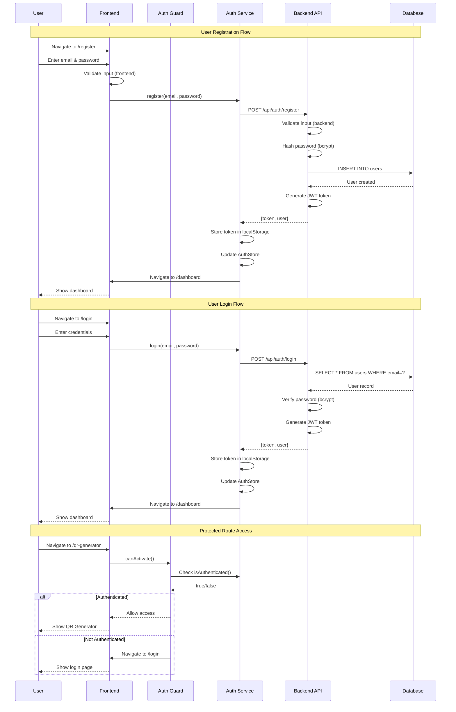
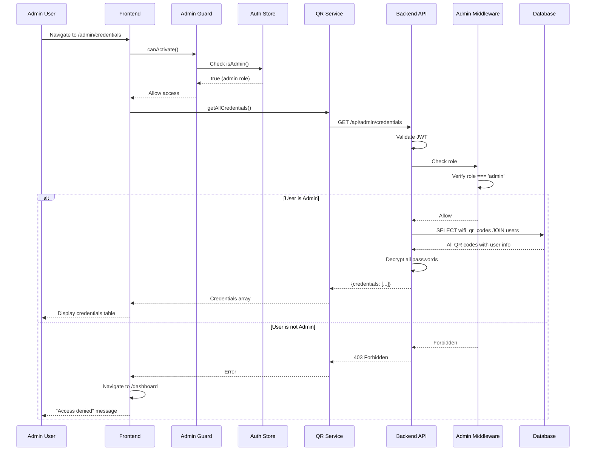
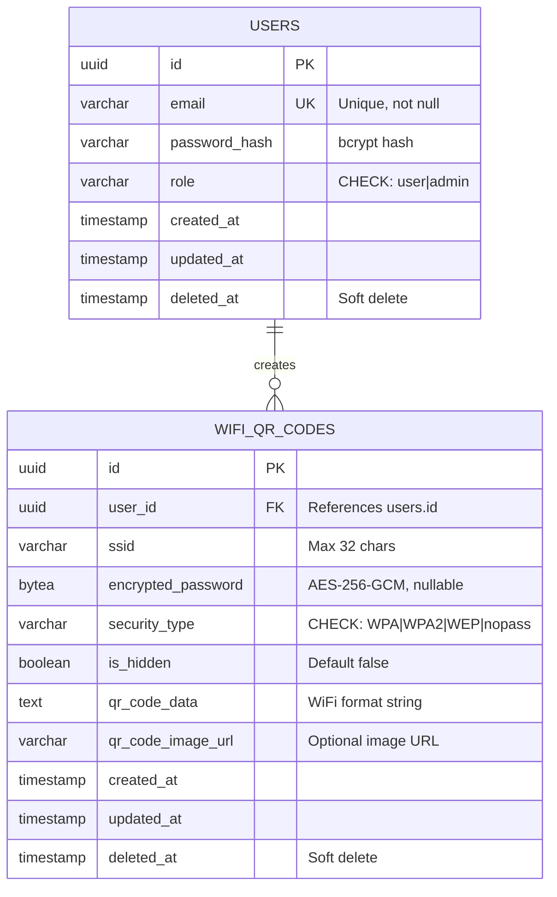

# WiFi QR Code Generator - Architecture Diagrams

This document contains visual representations of the system architecture using Mermaid diagrams and ASCII art.

---

## System Overview

```
┌───────────────────────────────────────────────────────────────────┐
│                         CLIENT LAYER                              │
│  ┌─────────────────────────────────────────────────────────────┐ │
│  │  Web Browser (Desktop & Mobile)                             │ │
│  │  - Chrome, Firefox, Safari, Edge                            │ │
│  │  - Mobile Browsers (iOS Safari, Chrome Android)             │ │
│  └─────────────────────────────────────────────────────────────┘ │
└───────────────────────────────────┬───────────────────────────────┘
                                    │ HTTPS
                                    │
┌───────────────────────────────────▼───────────────────────────────┐
│                      PRESENTATION LAYER                           │
│  ┌─────────────────────────────────────────────────────────────┐ │
│  │  Angular 21+ Frontend Application                          │ │
│  │  ┌──────────────┬──────────────┬──────────────┬──────────┐ │ │
│  │  │  Components  │   Services   │   Guards     │  Stores  │ │ │
│  │  │  - Login     │   - Auth     │   - Auth     │  - Auth  │ │ │
│  │  │  - Register  │   - QR Code  │   - Admin    │  - QR    │ │ │
│  │  │  - Dashboard │   - Storage  │              │          │ │ │
│  │  │  - QR Gen    │              │              │          │ │ │
│  │  │  - My Codes  │              │              │          │ │ │
│  │  │  - Admin     │              │              │          │ │ │
│  │  └──────────────┴──────────────┴──────────────┴──────────┘ │ │
│  └─────────────────────────────────────────────────────────────┘ │
└───────────────────────────────────┬───────────────────────────────┘
                                    │ REST API
                                    │ JSON over HTTPS
                                    │ JWT Authentication
┌───────────────────────────────────▼───────────────────────────────┐
│                      APPLICATION LAYER                            │
│  ┌─────────────────────────────────────────────────────────────┐ │
│  │  Go + Gin Web Framework                                     │ │
│  │  ┌──────────────────────────────────────────────────────┐  │ │
│  │  │  HTTP Layer                                          │  │ │
│  │  │  - Router                                            │  │ │
│  │  │  - Middleware (CORS, Auth, Admin, Logging)          │  │ │
│  │  └──────────────────────────────────────────────────────┘  │ │
│  │  ┌──────────────────────────────────────────────────────┐  │ │
│  │  │  Handler Layer                                       │  │ │
│  │  │  - Auth Handler (Register, Login)                   │  │ │
│  │  │  - QR Handler (CRUD operations)                     │  │ │
│  │  │  - Admin Handler (View all credentials)            │  │ │
│  │  └──────────────────────────────────────────────────────┘  │ │
│  │  ┌──────────────────────────────────────────────────────┐  │ │
│  │  │  Service Layer                                       │  │ │
│  │  │  - Auth Service (Login, Register)                   │  │ │
│  │  │  - User Service (User management)                   │  │ │
│  │  │  - QR Service (QR code business logic)              │  │ │
│  │  │  - JWT Service (Token generation/validation)        │  │ │
│  │  │  - Encryption Service (AES-256-GCM)                 │  │ │
│  │  └──────────────────────────────────────────────────────┘  │ │
│  │  ┌──────────────────────────────────────────────────────┐  │ │
│  │  │  Repository Layer                                    │  │ │
│  │  │  - User Repository (Database operations)            │  │ │
│  │  │  - QR Code Repository (Database operations)         │  │ │
│  │  └──────────────────────────────────────────────────────┘  │ │
│  └─────────────────────────────────────────────────────────────┘ │
└───────────────────────────────────┬───────────────────────────────┘
                                    │ SQL
                                    │ Connection Pool
                                    │
┌───────────────────────────────────▼───────────────────────────────┐
│                         DATA LAYER                                │
│  ┌─────────────────────────────────────────────────────────────┐ │
│  │  PostgreSQL 16+ Database                                    │ │
│  │  ┌──────────────────────────────────────────────────────┐  │ │
│  │  │  Tables                                              │  │ │
│  │  │  - users (id, email, password_hash, role)           │  │ │
│  │  │  - wifi_qr_codes (id, user_id, ssid, encrypted_pwd) │  │ │
│  │  └──────────────────────────────────────────────────────┘  │ │
│  │  ┌──────────────────────────────────────────────────────┐  │ │
│  │  │  Indexes                                             │  │ │
│  │  │  - Primary keys (UUID)                               │  │ │
│  │  │  - Foreign keys (user_id)                            │  │ │
│  │  │  - Unique indexes (email)                            │  │ │
│  │  │  - Composite indexes (user_id, created_at)           │  │ │
│  │  └──────────────────────────────────────────────────────┘  │ │
│  └─────────────────────────────────────────────────────────────┘ │
└───────────────────────────────────────────────────────────────────┘
```

---

## Authentication Flow



---

## QR Code Generation Flow

```mermaid
sequenceDiagram
    participant U as User
    participant QG as QR Generator Component
    participant QF as QR Form Component
    participant QS as QR Service
    participant I as JWT Interceptor
    participant B as Backend API
    participant ES as Encryption Service
    participant DB as Database
    participant QD as QR Display Component

    U->>QG: Navigate to /qr-generator
    QG->>QF: Render form
    U->>QF: Fill WiFi credentials
    U->>QF: Click "Generate"
    QF->>QF: Validate form
    QF->>QG: emit(formData)
    QG->>QS: createQRCode(formData)
    QS->>I: HTTP POST /api/qr-codes
    I->>I: Add Authorization header
    I->>B: POST with JWT token
    B->>B: Validate JWT
    B->>B: Extract userID from claims
    B->>B: Validate request data
    B->>ES: Encrypt(password)
    ES-->>B: encryptedPassword
    B->>B: Generate WiFi string
    Note over B: WIFI:T:WPA2;S:ssid;P:pass;H:false;;
    B->>DB: INSERT INTO wifi_qr_codes
    DB-->>B: QR code created
    B->>ES: Decrypt(encryptedPassword)
    ES-->>B: plainPassword
    B-->>QS: {qrCode with plain password}
    QS->>QS: Update QRCodeStore
    QS-->>QG: WiFiQRCode
    QG->>QG: Set generatedQRCode signal
    QG->>QD: Render QR display
    QD->>QD: Generate QR image
    QD-->>U: Show scannable QR code
```

---

## Admin Credential Access Flow



---

## Database Entity Relationship



---

## Component Hierarchy

```
App Component
│
├── Navbar Component (Smart)
│   ├── Logo
│   ├── Navigation Links (conditional on auth)
│   └── User Menu (conditional on auth)
│       └── Logout Button
│
├── Router Outlet
│   │
│   ├── Public Routes (No Guard)
│   │   ├── Login Component (Smart)
│   │   │   └── Login Form
│   │   └── Register Component (Smart)
│   │       └── Register Form
│   │
│   ├── Protected Routes (Auth Guard)
│   │   ├── Dashboard Component (Smart)
│   │   │   ├── Welcome Message
│   │   │   ├── Statistics
│   │   │   └── Quick Links
│   │   │
│   │   ├── QR Generator Component (Smart)
│   │   │   ├── QR Form Component (Dumb)
│   │   │   │   ├── SSID Input
│   │   │   │   ├── Password Input
│   │   │   │   ├── Security Type Select
│   │   │   │   └── Hidden Network Checkbox
│   │   │   └── QR Display Component (Dumb)
│   │   │       ├── QR Code Image
│   │   │       └── Credential Details
│   │   │
│   │   └── My Codes Component (Smart)
│   │       ├── Search/Filter
│   │       ├── Pagination
│   │       └── QR Card Component (Dumb) [Multiple]
│   │           ├── QR Preview
│   │           ├── Network Details
│   │           └── Action Buttons
│   │
│   └── Admin Routes (Auth Guard + Admin Guard)
│       └── Credentials Component (Smart)
│           ├── Search Bar
│           ├── Filters
│           ├── Pagination
│           └── Credential Table Component (Dumb)
│               ├── Table Headers
│               └── Table Rows
│                   ├── User Email
│                   ├── SSID
│                   ├── Password
│                   ├── Security Type
│                   └── Created Date
```

---

## Data Flow - State Management

```
┌────────────────────────────────────────────────────────────┐
│                     User Actions                           │
│  - Login                                                   │
│  - Create QR Code                                          │
│  - View QR Codes                                           │
│  - Delete QR Code                                          │
└────────────────┬───────────────────────────────────────────┘
                 │
                 ▼
┌────────────────────────────────────────────────────────────┐
│              Component Layer                               │
│  - Capture user input                                      │
│  - Validate forms                                          │
│  - Trigger actions                                         │
└────────────────┬───────────────────────────────────────────┘
                 │
                 ▼
┌────────────────────────────────────────────────────────────┐
│               Service Layer                                │
│  - AuthService                                             │
│  - QRCodeService                                           │
│  - HTTP requests to backend                                │
└────────────────┬───────────────────────────────────────────┘
                 │
                 ▼
┌────────────────────────────────────────────────────────────┐
│              HTTP Interceptors                             │
│  - JWT Interceptor (add token)                             │
│  - Error Interceptor (handle errors)                       │
└────────────────┬───────────────────────────────────────────┘
                 │
                 ▼
┌────────────────────────────────────────────────────────────┐
│                Backend API                                 │
│  - Process request                                         │
│  - Return response                                         │
└────────────────┬───────────────────────────────────────────┘
                 │
                 ▼
┌────────────────────────────────────────────────────────────┐
│               Signal Stores                                │
│  ┌──────────────────────┐  ┌──────────────────────┐       │
│  │   AuthStore          │  │   QRCodeStore        │       │
│  │  - user (signal)     │  │  - qrCodes (signal)  │       │
│  │  - token (signal)    │  │  - loading (signal)  │       │
│  │  - isAuthenticated   │  │  - error (signal)    │       │
│  │    (computed)        │  │  - qrCodeCount       │       │
│  │  - isAdmin           │  │    (computed)        │       │
│  │    (computed)        │  │                      │       │
│  └──────────────────────┘  └──────────────────────┘       │
└────────────────┬───────────────────────────────────────────┘
                 │
                 ▼
┌────────────────────────────────────────────────────────────┐
│          Component Re-rendering                            │
│  - Components subscribe to signals                         │
│  - Automatic updates when signals change                   │
│  - Fine-grained reactivity                                 │
└────────────────────────────────────────────────────────────┘
```

---

## Security Layers

```
┌─────────────────────────────────────────────────────────────┐
│  Layer 1: Transport Security                               │
│  - HTTPS (TLS 1.3)                                          │
│  - Certificate validation                                   │
└─────────────────────┬───────────────────────────────────────┘
                      │
┌─────────────────────▼───────────────────────────────────────┐
│  Layer 2: CORS Protection                                   │
│  - Whitelisted origins                                      │
│  - Preflight request handling                               │
└─────────────────────┬───────────────────────────────────────┘
                      │
┌─────────────────────▼───────────────────────────────────────┐
│  Layer 3: Authentication                                    │
│  - JWT token validation                                     │
│  - Token expiration check (1 hour)                          │
│  - Signature verification (HMAC-SHA256)                     │
└─────────────────────┬───────────────────────────────────────┘
                      │
┌─────────────────────▼───────────────────────────────────────┐
│  Layer 4: Authorization                                     │
│  - Role-based access control (RBAC)                         │
│  - User vs Admin permissions                                │
│  - Resource ownership verification                          │
└─────────────────────┬───────────────────────────────────────┘
                      │
┌─────────────────────▼───────────────────────────────────────┐
│  Layer 5: Input Validation                                  │
│  - Frontend form validation (Angular)                       │
│  - Backend request validation (go-playground/validator)     │
│  - Type checking (TypeScript + Go)                          │
└─────────────────────┬───────────────────────────────────────┘
                      │
┌─────────────────────▼───────────────────────────────────────┐
│  Layer 6: Business Logic Validation                         │
│  - Password strength requirements                           │
│  - WiFi password required for secured networks              │
│  - SSID length validation (max 32 chars)                    │
└─────────────────────┬───────────────────────────────────────┘
                      │
┌─────────────────────▼───────────────────────────────────────┐
│  Layer 7: Data Access Security                              │
│  - SQL injection prevention (GORM prepared statements)      │
│  - User data isolation (queries filtered by user_id)        │
│  - Soft deletes (audit trail)                               │
└─────────────────────┬───────────────────────────────────────┘
                      │
┌─────────────────────▼───────────────────────────────────────┐
│  Layer 8: Data Storage Security                             │
│  - User passwords: bcrypt (cost 10)                         │
│  - WiFi passwords: AES-256-GCM encryption                   │
│  - Database connection encryption (SSL/TLS)                 │
└─────────────────────────────────────────────────────────────┘
```

---

## Deployment Architecture

### Development Environment

```
┌──────────────────────────────────────────────────────────┐
│              Docker Compose Environment                  │
│                                                          │
│  ┌────────────────┐  ┌────────────────┐  ┌───────────┐ │
│  │   Frontend     │  │    Backend     │  │ PostgreSQL│ │
│  │   Container    │  │   Container    │  │ Container │ │
│  │                │  │                │  │           │ │
│  │  Angular Dev   │  │  Go with Air   │  │  Port     │ │
│  │  Server        │  │  (hot reload)  │  │  5432     │ │
│  │  Port 4200     │  │  Port 8080     │  │           │ │
│  │                │  │                │  │  Volume   │ │
│  │  Volume:       │  │  Volume:       │  │  Mounted  │ │
│  │  ./frontend    │  │  ./backend     │  │           │ │
│  └────────┬───────┘  └────────┬───────┘  └─────┬─────┘ │
│           │                   │                 │       │
│           └───────────┬───────┴─────────────────┘       │
│                       │                                 │
│              ┌────────▼────────┐                        │
│              │  Network Bridge │                        │
│              │  wifiqr-network │                        │
│              └─────────────────┘                        │
└──────────────────────────────────────────────────────────┘
```

### Production Environment

```
┌─────────────────────────────────────────────────────────────┐
│                     Load Balancer                           │
│              (AWS ALB / CloudFlare / nginx)                 │
└──────────────────┬──────────────────────────────────────────┘
                   │
        ┌──────────┴──────────┐
        │                     │
┌───────▼────────┐   ┌────────▼────────┐
│  Frontend CDN  │   │  API Gateway    │
│  (Static)      │   │  (nginx/traefik)│
│                │   └────────┬────────┘
│  - CloudFront  │            │
│  - Vercel      │   ┌────────┴────────┐
│  - Netlify     │   │                 │
└────────────────┘   │     ┌───────────▼──────────┐
                     │     │  Backend Cluster     │
                     │     │                      │
                     │     │  ┌─────┐    ┌─────┐ │
                     │     │  │ Pod │    │ Pod │ │
                     │     │  │  1  │    │  2  │ │
                     │     │  └──┬──┘    └──┬──┘ │
                     │     │     └──────────┘    │
                     │     └─────────┬───────────┘
                     │               │
                     │     ┌─────────▼───────────┐
                     │     │  PostgreSQL RDS     │
                     │     │                     │
                     │     │  - Primary          │
                     │     │  - Read Replicas    │
                     │     │  - Automated Backup │
                     │     └─────────────────────┘
                     │
                     └──────┐
                            │
                     ┌──────▼──────────┐
                     │  Monitoring     │
                     │                 │
                     │  - Prometheus   │
                     │  - Grafana      │
                     │  - CloudWatch   │
                     └─────────────────┘
```

---

## Request Flow Timeline

```
User Request: Create QR Code
│
├─ [0ms] User clicks "Generate QR Code"
│
├─ [5ms] Frontend: Form validation passes
│
├─ [10ms] Frontend: createQRCode() called
│
├─ [15ms] HTTP Interceptor: Add JWT token
│
├─ [20ms] Network: POST /api/qr-codes
│
├─ [50ms] Backend: Request received
│
├─ [52ms] CORS Middleware: Check origin
│
├─ [54ms] Logging Middleware: Log request
│
├─ [56ms] Auth Middleware: Validate JWT
│  │
│  ├─ Decode token
│  ├─ Verify signature
│  ├─ Check expiration
│  └─ Extract claims (userID, role)
│
├─ [60ms] Handler: Parse request body
│
├─ [62ms] Handler: Validate input
│
├─ [65ms] Service: Create QR code
│  │
│  ├─ Encrypt password (AES-256-GCM)
│  ├─ Generate WiFi string
│  └─ Prepare model
│
├─ [75ms] Repository: Insert to database
│  │
│  ├─ Execute INSERT query
│  └─ Return created record
│
├─ [85ms] Service: Decrypt password for response
│
├─ [90ms] Handler: Build success response
│
├─ [95ms] Network: Send response to frontend
│
├─ [120ms] Frontend: Receive response
│
├─ [122ms] QRCodeStore: Add QR code to state
│
├─ [125ms] Component: Update generatedQRCode signal
│
├─ [130ms] QR Display Component: Render QR code
│
└─ [150ms] User sees generated QR code

Total Time: ~150ms
```

---

**Document Version**: 1.0
**Last Updated**: 2025-01-15
**Purpose**: Visual reference for system architecture
